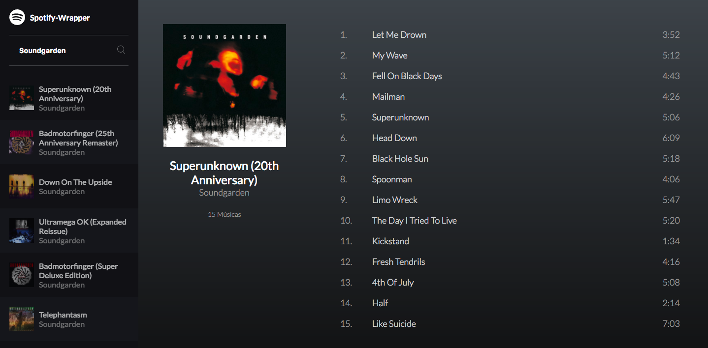

# Spotify Wrapper Player

## How to Run

1. First go to [Spotify Developers API](https://developer.spotify.com/web-api/) and create your Token. Then add your token on [src/spotify.js](src/spotify.js). **Remember that the token will expire in 60min**
2. Install the dependencies with `npm i`.
3. Run your application with `npm start`.
